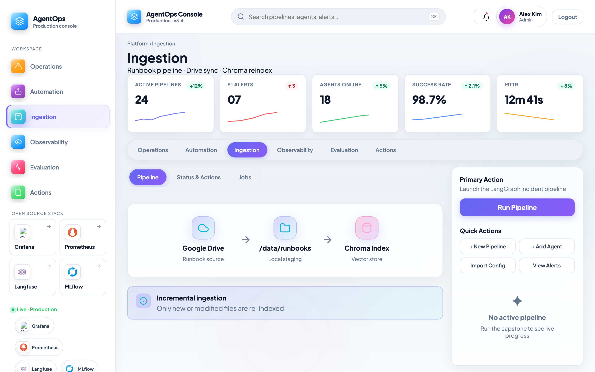
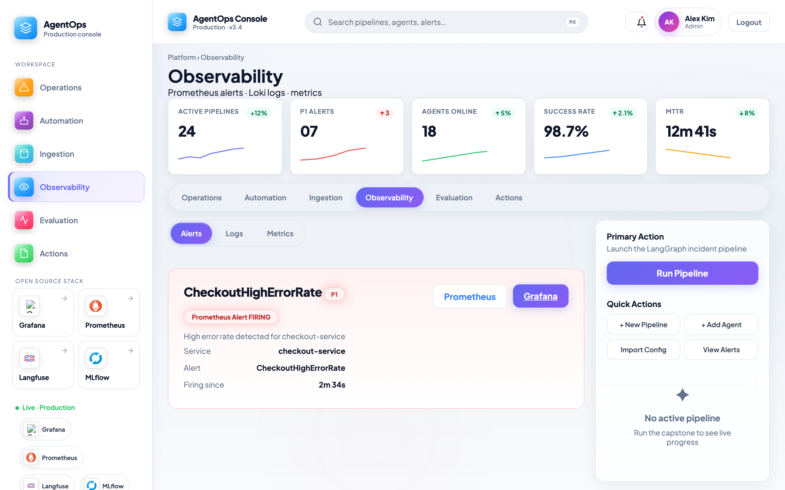
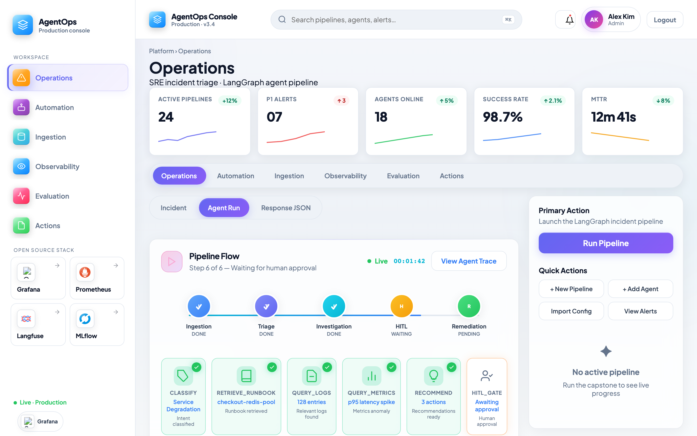
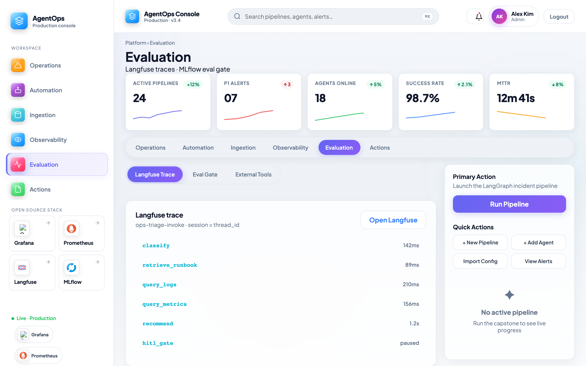
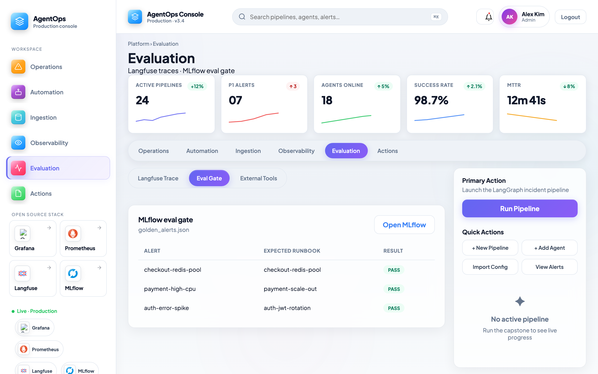
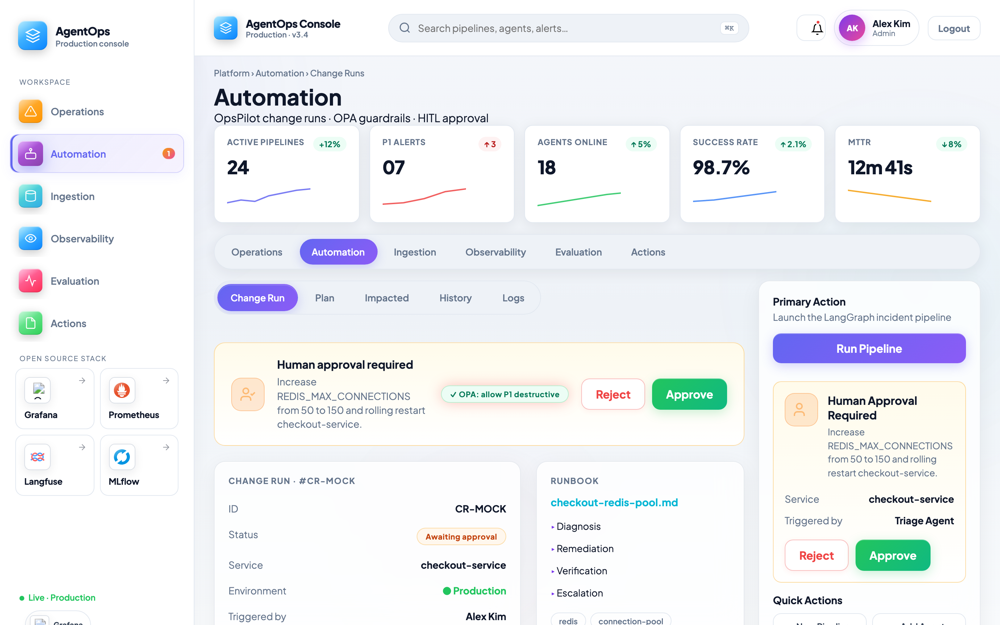
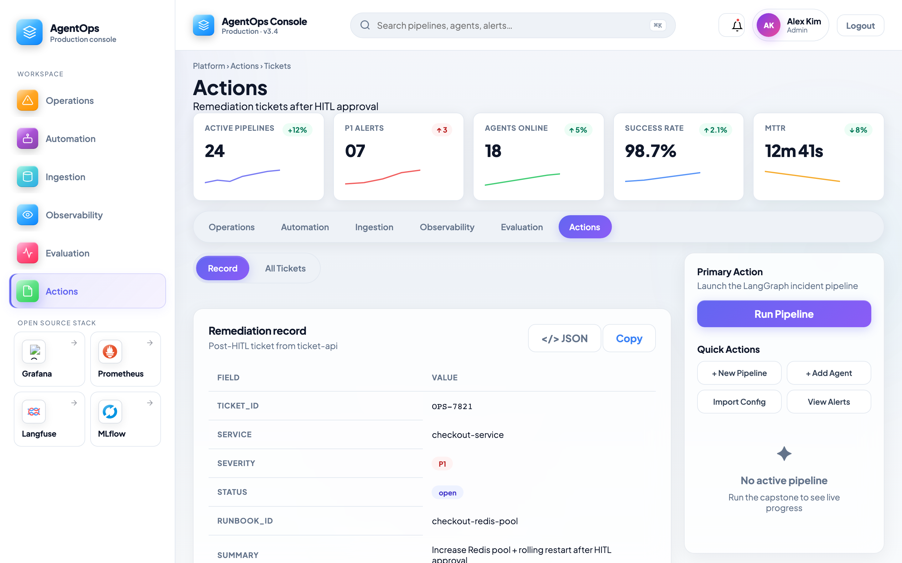

# Design 1 — Complete End-to-End Walkthrough

**Production AgentOps for SRE teams · Chroma + Loki + Prometheus + Langfuse**

> One document. Whole story. One capstone example threaded through every phase.  
> Use this to learn the system, demo to stakeholders, or adapt into a Medium post.

---

## Part 1 — The whole project, end to end

### What you are building

You are not building “a chatbot that reads logs.” You are building a **production SRE agent platform** — the same five-phase lifecycle used in enterprise AgentOps:

| Phase | Question it answers | Design 1 tools |
|-------|---------------------|----------------|
| **1 — Ingestion** | What signals and knowledge does the agent see? | Alertmanager, Loki, Promtail, Prometheus, Grafana, **Chroma**, **runbook-ingestion** |
| **2 — Orchestration** | How does the agent reason and call tools? | LangGraph, Platform UI, MCP, Ollama |
| **3 — Evaluation** | How do you trust it before and after deploy? | Langfuse, MLflow, OTEL |
| **4 — Guardrails** | What stops bad or unauthorized actions? | OPA/Rego, HITL, FastAPI guardrails |
| **5 — Action & CI/CD** | What happens after a decision? | PostgreSQL ticket-api, GitHub Actions |

Everything lives under [`architecture-design-1/`](.) as a **modular, Docker Compose stack** you can bring up phase by phase.

### The end-to-end flow (30-second version)

```
Runbooks land in Chroma          Alerts + logs + metrics land in Loki/Prometheus
         │                                        │
         └────────────────┬───────────────────────┘
                          ▼
              LangGraph agent triages incident
                          │
         ┌────────────────┼────────────────┐
         ▼                ▼                ▼
    Langfuse trace    MLflow eval      OPA + HITL
         │                │                │
         └────────────────┴────────────────┘
                          ▼
              Ticket opened in PostgreSQL
```

### Architecture at a glance


> **Note:** Mockup PNGs in [`images/mockups/`](images/mockups/) are screenshots of the **Platform UI v3.4** (light Grafana-inspired console with official OSS logos). Regenerate after UI changes: `./scripts/capture-mockups.sh` (gateway must be up at `:8080`). Langfuse, MLflow, and Grafana also run as real services at their own ports.

Official diagram: [`images/architecture-diagram.png`](images/architecture-diagram.png)

### Ports you will touch

| URL | Service |
|-----|---------|
| http://localhost:8080 | Platform UI (login + HITL) |
| http://localhost:8002 | Agent API |
| http://localhost:8090 | Alert webhook receiver |
| http://localhost:8092 | **Runbook ingestion** API |
| http://localhost:3000 | Langfuse |
| http://localhost:5001 | MLflow |
| http://localhost:3001 | Grafana 11 (datasources + dashboard auto-provisioned) |
| http://localhost:9090 | Prometheus |
| http://localhost:3100 | Loki |

**Platform login:** `operator@agentops.local` / `operator123`

**Grafana login (http://localhost:3001):** `admin` / `admin` (or your `GRAFANA_ADMIN_PASSWORD` from `deploy/.env`)  
After login: **Connections → Data sources** — you should see **Prometheus** and **Loki** (provisioned automatically).  
**Dashboards → AgentOps Design 1 → Checkout Redis Pool Incident** — pre-built demo dashboard.  
If datasources are missing: `docker compose -p agentops-design-1 -f deploy/docker-compose.yml restart grafana`

**Langfuse login (http://localhost:3000):** `a@ex.com` / `123456789`  
**Langfuse version:** self-hosted **2.x** (`langfuse/langfuse:2.95.11` in docker-compose — check footer or `/api/public/health` → `"version":"2.95.11"`).  
This is **not** Langfuse 3.x. Do not confuse with **Platform UI v3.4** (the course console at `:8080`).

### UI mockup map (platform vs external)

| Walkthrough step | Mockup | Where to see it |
|------------------|--------|-----------------|
| Step 0 — Runbook ingestion | [`step-01b-runbook-ingestion.png`](images/mockups/step-01b-runbook-ingestion.png) | Platform → **Ingestion** → Pipeline tab (`:8092` status, reindex, sync) |
| Step 1 — Alerts/logs/metrics | [`step-01-ingestion-observability.png`](images/mockups/step-01-ingestion-observability.png) | Platform → **Observability** → Alerts + external **Grafana** / **Prometheus** |
| Step 2 — Agent orchestration | [`step-02-agent-orchestration.png`](images/mockups/step-02-agent-orchestration.png) | Platform → **Operations** → Agent Run (6-step pipeline flow, Langfuse trace link) |
| Step 3 — Langfuse trace | [`step-03-langfuse-trace.png`](images/mockups/step-03-langfuse-trace.png) | Platform → **Evaluation** → Langfuse Trace + external **Langfuse** (`:3000`) |
| Step 4 — MLflow eval gate | [`step-04-mlflow-evals.png`](images/mockups/step-04-mlflow-evals.png) | Platform → **Evaluation** → Eval Gate + external **MLflow** (`:5001`) |
| Step 4 — HITL / OPA | [`step-05-hitl-opa-guardrails.png`](images/mockups/step-05-hitl-opa-guardrails.png) | Platform → **Automation** → Change Run (OpsPilot; auto-opens on `awaiting_hitl`) |
| Step 5 — Ticket record | [`step-06-ticket-action.png`](images/mockups/step-06-ticket-action.png) | Platform → **Actions** → Ticket detail + table; toast after approve |
| Architecture overview | [`step-00-architecture-overview.png`](images/mockups/step-00-architecture-overview.png) | Doc diagram [`images/architecture-diagram.png`](images/architecture-diagram.png) |

**Capstone flow in the UI:** Operations (run pipeline) → Automation (approve) → Actions (OPS- ticket).

### How to start the stack

```bash
cd deploy
cp .env.example .env
./deploy.sh up
./deploy.sh verify
./deploy.sh demo
```

Deep implementation notes: [`IMPLEMENTATION.md`](IMPLEMENTATION.md) · [`ENTERPRISE-READINESS.md`](ENTERPRISE-READINESS.md)

---

## Part 2 — One example for your mind (the capstone story)

Use this single incident everywhere. If you can picture this story, you understand the whole system.

### The incident

**Service:** `checkout-service`  
**Severity:** P1  
**Alert:** HTTP 500 spike on `/checkout`  
**Log line:** `Timeout waiting for connection pool (Redis)`

**Fixture file:** `agent/sample_data/alerts/checkout-redis-pool.json`

**Runbook:** `agent/rag/runbooks/checkout-redis-pool.md`  
→ recommends increasing `REDIS_MAX_CONNECTIONS` and rolling restart (requires human approval).

### The story in one paragraph

Prometheus sees error rate spike → alert fires → webhook hits the agent → LangGraph classifies the alert, **retrieves the Redis pool runbook from Chroma**, pulls matching logs from **Loki** and error-rate from **Prometheus**, recommends remediation → **Langfuse** records every step → **OPA** checks the action is allowed for P1 → **HITL** pauses because the fix is destructive → operator approves in the **Platform UI** → **ticket-api** writes a row to **PostgreSQL**.

That is the entire course in one sentence.

---

## Part 3 — Step by step (what each phase does + what you should expect to see)

---

### Step 0 — Before anything runs: runbooks become searchable

**What happens**

- Git seed runbooks copy into `/data/runbooks`.
- Optional: **Google Drive folder** syncs new/changed `.md` files (midnight cron or on-demand).
- `runbook-ingestion` chunks + embeds markdown → **Chroma** vector index.
- Full rebuild uses a **new collection + alias swap** (`active.json`); incremental only re-indexes changed files.

**Why it matters**

The agent does not hallucinate procedures — it retrieves `checkout-redis-pool.md` at runtime.

**What you should expect to see**

Open **http://localhost:8080** → sidebar **Runbook Ingestion** (Runbook Platform layout; live `:8092` API).

Reference mockup:


**Try it**

1. Open **http://localhost:8080** → sign in → sidebar **Ingestion**
2. **Pipeline** tab — see Drive → `/data/runbooks` → Chroma flow
3. **Status & Actions** — active collection, last job, **Reindex now** / **Sync Drive**
4. **Chroma Index** tab — browse every embedded chunk (runbook, service, text preview, 384-dim vectors)

```bash
# Status (direct API)
curl -H "Authorization: Bearer $INGESTION_API_TOKEN" \
  http://localhost:8092/v1/ingest/status

# Browse indexed chunks
curl -H "Authorization: Bearer $INGESTION_API_TOKEN" \
  "http://localhost:8092/v1/ingest/index?limit=500"

# On-demand incremental reindex (+ Drive sync if enabled)
./deploy.sh reindex incremental
```

**Without Google Drive:** seed runbooks from git (`agent/rag/runbooks/*.md`) are copied into `/data/runbooks` on every reindex — that is enough for the capstone demo.

### Google Drive setup (optional)

Use Drive as a “drop zone” for `.md` runbooks. The midnight cron (or **Sync Drive** in the UI) pulls changes, then incremental reindex embeds them into Chroma.

1. **Create a Google Cloud service account**
   - [Google Cloud Console](https://console.cloud.google.com/) → IAM → Service Accounts → Create
   - Keys → Add key → JSON → save as:
     ```
     deploy/secrets/google-service-account.json
     ```
   - Note the service account email (e.g. `runbooks@my-project.iam.gserviceaccount.com`)

2. **Create a Drive folder** for runbooks (only `.md` files at the top level — no subfolders)

3. **Share the folder** with the service account email (Viewer is enough)

4. **Copy the folder ID** from the URL:
   ```
   https://drive.google.com/drive/folders/<FOLDER_ID>
   ```

5. **Edit `deploy/.env`:**
   ```env
   GOOGLE_DRIVE_ENABLED=true
   GOOGLE_DRIVE_FOLDER_ID=<your-folder-id>
   ```

6. **Restart ingestion** (picks up env + secret mount):
   ```bash
   cd deploy
   docker compose -p agentops-design-1 up -d --force-recreate runbook-ingestion
   ```

7. **Test sync**
   - UI: **Ingestion → Status & Actions → Sync Drive**
   - CLI: `curl -X POST -H "Authorization: Bearer $INGESTION_API_TOKEN" http://localhost:8092/v1/ingest/sync-drive`
   - Upload or edit a `.md` file in the Drive folder, sync again, then check **Chroma Index** tab

**Verify in UI:** Status tab shows `Enabled · folder <id>` when ready. Chroma Index lists new runbooks after sync + reindex.

**Mind picture:** Google Drive is the “drop zone”; ingestion is the factory; Chroma is the library the agent searches.

---

### Step 1 — Phase 1: Ingestion (alerts, logs, metrics)

**What happens**

| Signal | Path |
|--------|------|
| **Alerts** | Prometheus rule `CheckoutHighErrorRate` → Alertmanager → alert-receiver → agent |
| **Logs** | Sample JSONL → Promtail → Loki (agent queries LogQL) |
| **Metrics** | metrics-exporter → Prometheus (agent queries PromQL) |
| **Dashboards** | Grafana shows Loki + Prometheus together |

**Capstone moment**

When the checkout alert fires, Grafana shows the spike; Loki shows Redis pool timeout lines; Prometheus shows `service_error_rate{service="checkout-service"} > 0.05`.

**What you should expect to see**

Platform → **Checkout Overview** (capstone alert, Loki log preview, error_rate chart) and external Grafana at http://localhost:3001.



**Try it**

```bash
curl -sf http://localhost:3100/ready
curl -sf http://localhost:9090/-/healthy
curl -X POST http://localhost:8090/webhook/alert/checkout-redis-pool.json
```

**Mind picture:** Phase 1 is the **senses** of the agent — ears (alerts), eyes (logs), pulse (metrics).

---

### Step 2 — Phase 2: Orchestration (LangGraph agent)

**What happens**

Graph pipeline:

```
classify → retrieve_runbook → query_logs → query_metrics → recommend → hitl_gate → execute
```

| Node | Capstone behavior |
|------|-------------------|
| `classify` | P1 + checkout error → `requires_hitl: true` |
| `retrieve_runbook` | Top hit: `checkout-redis-pool` |
| `query_logs` | Returns checkout-service timeout lines from Loki |
| `query_metrics` | Returns elevated `error_rate_5m` from Prometheus |
| `recommend` | “Increase REDIS_MAX_CONNECTIONS… rolling restart…” |
| `hitl_gate` | **Pauses** — waits for human |
| `execute` | After approval → creates ticket |

**What you should expect to see**

Open **http://localhost:8080** — run capstone scenario; pipeline steps animate live.

Reference mockup:  


**Try it**

```bash
# Direct agent invoke
curl -X POST http://localhost:8002/invoke \
  -H "Content-Type: application/json" \
  -d @../agent/sample_data/alerts/checkout-redis-pool.json

# Or use Platform UI at http://localhost:8080
# Scenario: "Checkout Redis pool (capstone)"
```

**Mind picture:** Phase 2 is the **brain + hands** — LangGraph is the brain; MCP/tools are the hands.

---

### Step 3 — Phase 3: Evaluation (Langfuse + MLflow + OTEL)

**What happens**

| Tool | Role in capstone |
|------|------------------|
| **Langfuse** | One trace per invoke — every graph node visible |
| **MLflow** | Eval gate scores golden alerts before deploy |
| **OTEL** | Standard span pipeline (collector on `:4318`) |

**What you should expect to see**

Platform → **Traces & Eval Gate** (span list + golden-alert table) and external Langfuse / MLflow UIs.

In Langfuse you should see a trace named `ops-triage-invoke` with spans matching each graph node. Session ID = `thread_id` (same ID you use for HITL approve).



**MLflow — what eval gate success looks like**

Golden alerts (including checkout-redis) must match expected runbook IDs before CI passes. See the same view under **Traces & Eval Gate** in the platform.



**Try it**

```bash
./deploy.sh eval                    # runs golden_alerts.json gate
open http://localhost:3000         # Langfuse UI
open http://localhost:5001         # MLflow UI
```

**Mind picture:** Phase 3 is the **quality department** — prove the agent is grounded and repeatable.

---

### Step 4 — Phase 4: Guardrails (OPA + HITL)

**What happens**

1. **FastAPI guardrails** block malformed or injection-style alert payloads at the API edge.
2. **OPA/Rego** checks whether the recommended action is allowed (destructive verbs + severity rules).
3. **HITL** — LangGraph `interrupt_before` on `hitl_gate`; Platform UI shows Approve / Deny.
4. **Slack** (optional) — when `SLACK_WEBHOOK_URL` is set, agent posts to your channel when approval is needed.

For the capstone, restart/scale language triggers HITL even after OPA allows P1 destructive fixes.

**Slack setup**

1. Slack → create app → **Incoming Webhooks** → add to `#agentops-approvals`
2. Copy webhook URL into `deploy/.env`:
   ```
   SLACK_WEBHOOK_URL=https://hooks.slack.com/services/XXX/YYY/ZZZ
   ```
3. Restart stack: `./deploy.sh up`
4. Fire capstone alert — message appears with **Open OpsPilot** button (deep-links to Change Runs)

**What you should expect to see**

Platform → **Change Runs** (OpsPilot). Approve/Deny calls `/api/agents/approve`.



**Try it**

```bash
# After invoke returns thread_id and status awaiting_hitl
curl -X POST http://localhost:8002/approve \
  -H "Content-Type: application/json" \
  -d '{"thread_id":"<THREAD_ID>","approved":true}'
```

**Mind picture:** Phase 4 is the **airbag** — automation stops until a human says yes.

---

### Step 5 — Phase 5: Action & CI/CD (ticket + pipeline)

**What happens**

- Approved remediation → `ticket-api` POST → row in **PostgreSQL** (`OPS-xxxxxxxx`).
- GitHub Actions runs lint, pytest, eval gate on every push.
- Changing `agent/rag/runbooks/**` can trigger remote reindex workflow.

**What you should expect to see**

Platform → **Tickets** (remediation record detail card + list). Toast appears after HITL approve.



**Try it**

```bash
curl -sf http://localhost:8091/tickets | python3 -m json.tool
```

**Mind picture:** Phase 5 is the **audit trail** — every automated action leaves a record and passes through CI.

---

## Part 4 — Full capstone script (copy-paste demo)

Run this after `./deploy.sh up` and `./deploy.sh verify`:

```bash
cd deploy

# 1) Fire alert through webhook adapter
RESP=$(curl -sf -X POST http://localhost:8090/webhook/alert/checkout-redis-pool.json)
echo "$RESP" | python3 -m json.tool

# 2) Extract thread_id
THREAD=$(echo "$RESP" | python3 -c "import sys,json; print(json.load(sys.stdin)['agent_response']['thread_id'])")

# 3) Approve HITL
curl -sf -X POST http://localhost:8002/approve \
  -H "Content-Type: application/json" \
  -d "{\"thread_id\":\"$THREAD\",\"approved\":true}" | python3 -m json.tool

# 4) Confirm ticket
curl -sf http://localhost:8091/tickets | python3 -m json.tool
```

**Checklist — you succeeded when:**

- [ ] Runbook retrieved: `runbook_id` = `checkout-redis-pool`
- [ ] Langfuse shows trace with all graph spans
- [ ] HITL paused then completed after approve
- [ ] Ticket row exists with severity P1
- [ ] `./deploy.sh eval` passes

---

## Part 5 — Operator runbook (day-2)

| Task | Command |
|------|---------|
| Start stack | `./deploy.sh up` |
| Health check | `./deploy.sh verify` |
| Capstone demo | `./deploy.sh demo` |
| Reindex runbooks | `./deploy.sh reindex incremental` |
| Full rebuild index | `./deploy.sh reindex full` |
| Eval gate | `./deploy.sh eval` |
| Tear down | `./deploy.sh down` |

### Google Drive incremental sync

1. Add `deploy/secrets/google-service-account.json`
2. Share Drive folder with service account email
3. Set in `.env`:
   ```
   GOOGLE_DRIVE_ENABLED=true
   GOOGLE_DRIVE_FOLDER_ID=<your-folder-id>
   ```
4. Midnight UTC cron runs sync + incremental reindex automatically

See [`deploy/secrets/README.md`](deploy/secrets/README.md)

---

## Part 6 — Adapting this for Medium

Suggested article structure (this doc maps 1:1):

1. **Hook** — “Your on-call agent shouldn’t guess runbooks” (Part 1 intro)
2. **Architecture** — five phases + overview mockup
3. **One incident story** — checkout-redis-pool (Part 2)
4. **Walk through each phase** — Parts 3 Steps 0–5 with mockups
5. **Live demo commands** — Part 4
6. **Production lessons** — shared Chroma volume, ingestion pipeline, HITL, eval gate (Part 5 + ENTERPRISE-READINESS)
7. **CTA** — link to course repo / compose stack

**Images for Medium:** all mockups live in [`images/mockups/`](images/mockups/) — upload as figures with captions from this doc.

**Tone tip:** Keep the capstone thread visible in every section header so readers never lose the plot.

---

## Related docs

| Doc | Purpose |
|-----|---------|
| [`README.md`](README.md) | Architecture + tool matrix |
| [`IMPLEMENTATION.md`](IMPLEMENTATION.md) | Dev/deploy commands |
| [`ENTERPRISE-READINESS.md`](ENTERPRISE-READINESS.md) | Gap analysis + ingestion pipeline |
| [`PHASE-MAP.md`](PHASE-MAP.md) | Port map |
| [`phases/`](phases/) | Short phase cheat sheets |

---

*Design 1 — SRE ops only. Fixed across all designs: LangGraph · Ollama · Platform UI · checkout-redis-pool capstone.*
