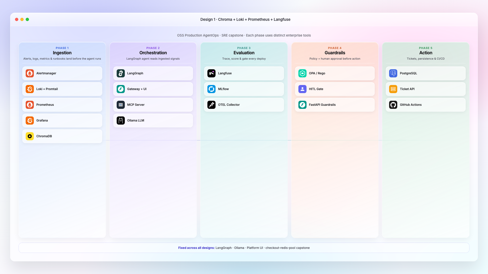
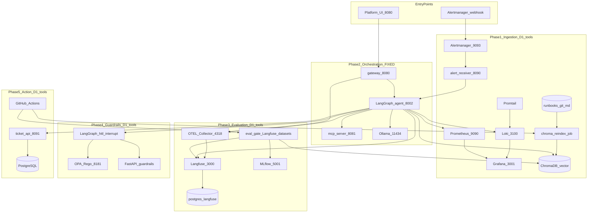

# Architecture Design 1 — Chroma + Loki + Prometheus + Langfuse

See [`diagram.html`](diagram.html) (editable source) · regenerate PNG: [`../scripts/render-diagrams.sh`](../scripts/render-diagrams.sh)



**Tagline:** Lightweight, widely adopted OSS path — embedded vector store, Grafana Loki stack, Langfuse LLM engineering platform.

**When to pick:** Greenfield teams, fast local dev, Langfuse as single pane for traces / sessions / prompts / evals.

**Run the stack:** [`DESIGN-1-COMPLETE-WALKTHROUGH.md`](DESIGN-1-COMPLETE-WALKTHROUGH.md) · [`IMPLEMENTATION.md`](IMPLEMENTATION.md) · `cd deploy && ./deploy.sh up`

---

## Full architecture diagram



---

## Tool map — Design 1 primaries + alternatives

### Phase 1 — Ingestion

| Section | **Design 1 primary** | Alt 1 | Alt 2 |
|---------|------------------------|-------|-------|
| Alert routing | **Alertmanager** | Grafana OnCall | Kapacitor |
| Logs | **Loki** + Promtail | Fluent Bit → Loki | Vector → Loki |
| Metrics | **Prometheus** | VictoriaMetrics | Mimir |
| Dashboards | **Grafana** | Prometheus UI | Redash |
| **Vector / runbooks** | **ChromaDB** | Qdrant | FAISS file index |
| Ingestion | **`runbook-ingestion` API + Drive cron** | CI reindex workflow | Manual CLI |
| Drop zone | Google Drive folder + git seed | — | — |

### Phase 2 — Orchestration (fixed)

| Section | Primary |
|---------|---------|
| Graph | **LangGraph** |
| API | FastAPI agent + gateway |
| LLM | Ollama / OpenAI API |

### Phase 3 — Evaluation

| Section | **Design 1 primary** | Alt 1 | Alt 2 |
|---------|------------------------|-------|-------|
| Tracing | **Langfuse** | LangSmith (SaaS) | Jaeger |
| Sessions | **Langfuse sessions** | — | OTEL traceparent |
| Prompt registry | **Langfuse Prompt Management** | Git prompts | LangSmith hub |
| Evals | **Langfuse datasets + eval gate** | DeepEval | Braintrust (SaaS) |
| Experiments | **MLflow** | W&B | Neptune |
| Distributed traces | **OTEL Collector → Langfuse OTLP** | OTEL → Jaeger | Datadog (SaaS) |

### Phase 4 — Guardrails

| Section | **Design 1 primary** | Alt 1 | Alt 2 |
|---------|------------------------|-------|-------|
| Action policy | **OPA / Rego** | Cedar | OpenFGA |
| Content safety | **FastAPI guardrails** | Presidio | NeMo Guardrails |
| HITL | Platform UI + interrupt | — | — |

### Phase 5 — Action

| Section | **Design 1 primary** | Alt 1 | Alt 2 |
|---------|------------------------|-------|-------|
| Tickets + checkpoints | **PostgreSQL** | SQLite dev | CockroachDB |
| CI/CD | **GitHub Actions** | GitLab CI | Tekton |

---

## Observability trio (Design 1)

| # | Tool | Role |
|---|------|------|
| 1 | **Langfuse** | Traces, sessions, prompts, evals |
| 2 | **MLflow** | Eval experiment metrics |
| 3 | **OTEL Collector** | Standard span pipeline → Langfuse |

---

## SRE capstone data path

```
Alert → agent → Chroma RAG (checkout-redis-pool.md)
              → Loki LogQL (pool timeout logs)
              → Prometheus (error rate)
              → Langfuse trace → HITL → ticket
```

**Compare:** [Design 2 — Weaviate + ELK](../architecture-design-2/) · [Design 3 — OpenSearch](../architecture-design-3/)

See [`PHASE-MAP.md`](PHASE-MAP.md) · [`diagram-full.md`](diagram-full.md)
