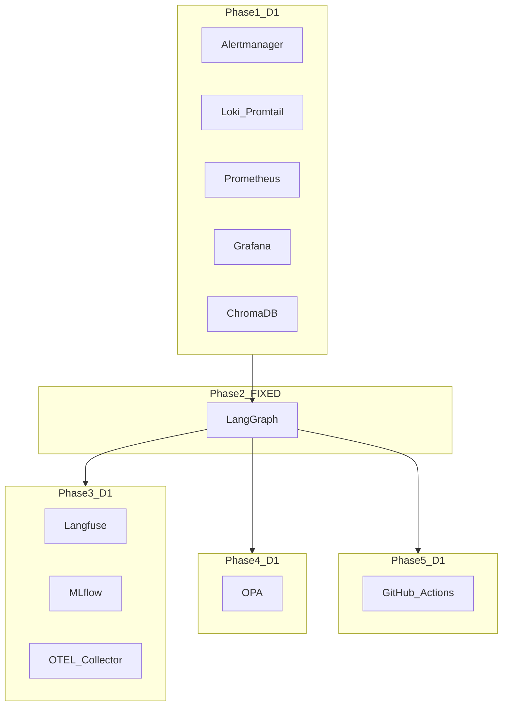

# Design 1 diagram — Chroma + Loki + Prometheus + Langfuse

See [`README.md`](README.md) for tool tables.

```mermaid
flowchart TB
  subgraph phase1 [Phase1_D1]
    AM[Alertmanager]
    LOKI[Loki_Promtail]
    PROM[Prometheus]
    GRAF[Grafana]
    CHROMA[ChromaDB]
  end
  subgraph phase2 [Phase2_FIXED]
    LG[LangGraph]
  end
  subgraph phase3 [Phase3_D1]
    LF[Langfuse]
    MLF[MLflow]
    OTEL[OTEL_Collector]
  end
  subgraph phase4 [Phase4_D1]
    OPA[OPA]
  end
  subgraph phase5 [Phase5_D1]
    GHA[GitHub_Actions]
  end
  phase1 --> LG
  LG --> phase3
  LG --> phase4
  LG --> phase5
```
